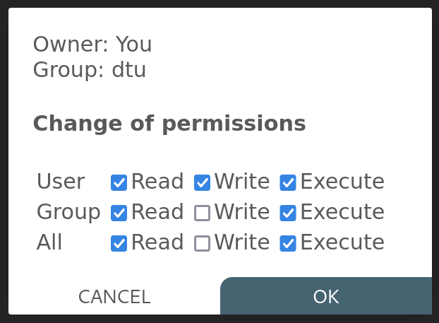

# QIM & Filestash
This is the [QIM platform](https://platform.qim.dk/) version of Filestash, forked from the [original](https://github.com/mickael-kerjean/filestash).

# Added features

Change file permissions

### What's going on?
We were relying on Filestash for some time, however at some point, we got a lot 
of requests to switch to something that allows users to change
permissions to their projects.

Filestash doesn't support that by default, because <a href = "https://github.com/mickael-kerjean/filestash/issues/192">apparently </a> it is 
complicated to add this feature to all possible backends. Since we were
only using SFTP, the feature is possible. 

### What's different?
- Files have one more action icon to click.
- This action icon creates a popup window
- You see owner and group of the file/folder
- If you are the owner, you can change the file permissions
- Get a notification that it worked

Copy file path

A new action button was added, so that it is also possible to copy the absolute path to a file or directory.

